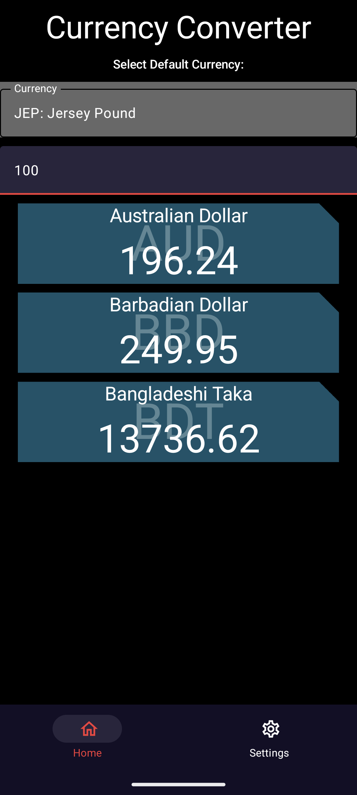
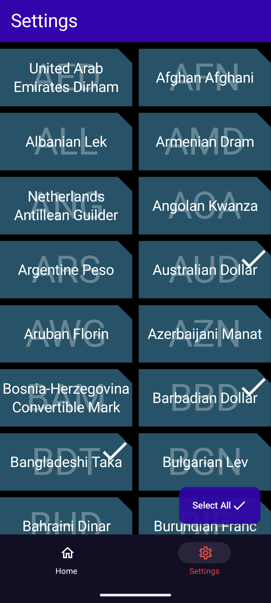
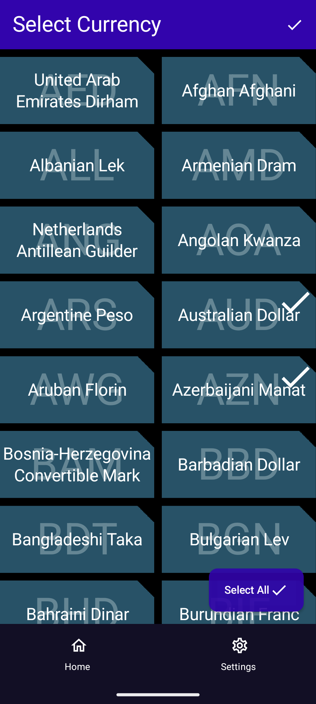
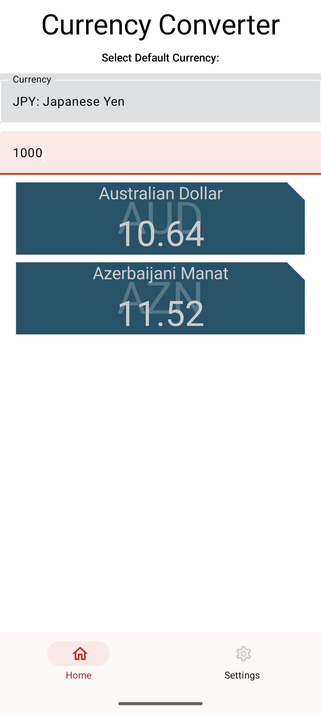

# **CConverter App**

#### **CConverter App** The native Android application for currency conversion using open exchange API :dollar: :chart:

#### This app uses free version of API to convert currency [API Doc](https://docs.openexchangerates.org/reference/api-introduction)

## System Requirements
- Android min sdk      : 26
- Android compile sdk  : 34
- Java runtime         : 17
- Studio               : 3+

## Architecture :house:
- Project is developed using MVVM with clean architecture
  - Code is even more easily testable than with plain MVVM.
  - Code is further decoupled (the biggest advantage.)
  - The package structure is even easier to navigate.
  - Can add new features even more quickly.
  - The project is even easier to maintain.

## Package Structure
        
        com.open.exchange.cconverter/    #root
        ├─ app
        ├─ di/
        ├─ presentation/
        │  ├─ navigation/
        │  ├─ screen/
        │  ├─ ui/
        │  │  ├─ components/
        │  │  ├─ theme/
        │  ├─ utils/
        ├─ data/
        │  ├─ dao/
        │  ├─ local/
        │  ├─ mapper/
        │  ├─ remote/
        │  ├─ repository/
        │  ├─ models/
        ├─ domain/
        │  ├─ models/
        │  ├─ usecase/
        │  ├─ repository/
        ├─ .gitignore
        ├─ package.json
        ├─ README.md
        gradle.kts
        gradle.wrapper.properties
        settings.gradle

## Built With :hammer:
- [Kotlin](https://kotlinlang.org/) - First class and official programming language for Android development.
- [Jetpack Compose](https://developer.android.com/jetpack/compose?gclid=CjwKCAiArOqOBhBmEiwAsgeLmUlv4dbl6KV3yBs7SXOpYReSF8DaG5yWJipHnkO-OEWgyMHgjn1BixoC8bUQAvD_BwE&gclsrc=aw.ds) - Jetpack Compose is Android’s modern toolkit for building native UI.
- [Material 3](https://m3.material.io) - Material Design 3, Google’s most expressive and adaptable design system
- [Coroutines](https://kotlinlang.org/docs/reference/coroutines-overview.html) - For asynchronous and more..
- [Flow](https://kotlin.github.io/kotlinx.coroutines/kotlinx-coroutines-core/kotlinx.coroutines.flow/-flow/) - A cold asynchronous data stream that sequentially emits values and completes normally or with an exception.
- [StateFlow](https://developer.android.com/kotlin/flow/stateflow-and-sharedflow) - StateFlow is a state-holder observable flow that emits the current and new state updates to its collectors.
- [Android Architecture Components](https://developer.android.com/topic/libraries/architecture) - Collection of libraries that help you design robust, testable, and maintainable apps.
- [ViewModel](https://developer.android.com/topic/libraries/architecture/viewmodel) - Stores UI-related data that isn't destroyed on UI changes.
- [Exoplayer](https://exoplayer.dev) - Exoplayer library is used to play media in Android.
- [Dependency Injection](https://developer.android.com/training/dependency-injection) -
- [Hilt-Dagger](https://dagger.dev/hilt/) - Standard library to incorporate Dagger dependency injection into an Android application.
- [Hilt-ViewModel](https://developer.android.com/training/dependency-injection/hilt-jetpack) - DI for injecting `ViewModel`.
- [Retrofit](https://github.com/square/retrofit) - An Http Client for android.
- [GSON Converter](https://github.com/square/retrofit/tree/master/retrofit-converters/gson) - A Converter which uses Moshi for serialization to and from JSON.
- [Material Components for Android](https://github.com/material-components/material-components-android) - Modular and customizable Material Design UI components for Android.

## :camera: Screenshots

!  |  |  |   |  